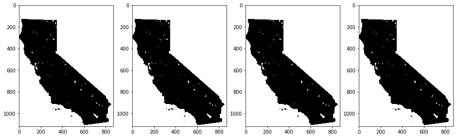

# ts-raster

ts-raster is a python package for extracting and analyzing of time-series characteristics from raster data. The feature extraction follows the footsteps of approaches developed in the python package <a href="https://github.com/blue-yonder/tsfresh">tsfresh</a>. 

- input : historical raster data (e.g. Monthly temperature data (2000-2018) 
- Extracted Feature: Mean, minimum, maximum, standard deviation... characteristics for all the data 
- output: data frame(CSV) or (array)Raster file

For analysis, several machine learning models as well as an ensemble modeling technique are incorporated. 


### Installation
stable version:
    
    pip install tsraster

from github: 

    git clone https://github.com/adbeda/ts-raster
    cd ts-raster
    pip install e .


### Input Data Structure

The input raster files from which features will be extracted are organized to allow extraction from files contained multiple folders.

Example data:

    temprature
        2005
            tmx-200501.tif 
            tmx-200502.tif
            tmx-200503.tif ...
        2006
            tmx-200601.tif
            tmx-200602.tif
            tmx-200603.tif...
        2007
            ...
  
 temprature: *the variable* <br>
  - 2005, 2006, 2007: *the years* <br>
    - tmx-200501.tif: the image <br>
        - tmx : unique identifier of each image <br>
        - 200501: year and month 
    
<br>

ts-raster will consider the value '200501' as a unique time identifier.

#### Usage:


```python

from tsraster.prep import sRead as tr
from tsraster.calculate import calculateFeatures


#directory
path = "../docs/img/temperature/"


image_name = tr.image_names(path)
print(image_name)
```

    ['tmx-200601', 'tmx-200603', 'tmx-200602', 'tmx-200703', 'tmx-200702', 'tmx-200701', 'tmx-200501', 'tmx-200502', 'tmx-200503']


Convert each image to array and stack them as bands


```python

rasters = tr.image2array(path)
rasters.shape
```
    (1120, 872, 9)


Calculate features

```python
ts_features = calculateFeatures(path)
```

    Feature Extraction: 100%|██████████| 80/80 [01:18<00:00,  1.02it/s]

output: dataframe

    variable  value__maximum  value__mean  value__median  value__minimum
    id                                                                  
    1.0                  0.0          0.0            0.0             0.0
    2.0                  0.0          0.0            0.0             0.0
    3.0                  0.0          0.0            0.0             0.0
    4.0                  0.0          0.0            0.0             0.0
    5.0                  0.0          0.0            0.0             0.0


output: image




ts-raster also supports:
    
   - creation of tiff file as an output containing each feature
   - random sampling from raster images using a vector file (GeoJson or Shapefile) for masking is required.
   - training and testing machine learning models (random forest, xgboost, elasticnet)
  
 ### Development
 
 The current version of ts-raster extracts only 4 features but can be customized by the user. 
 Read up the list of features that can be extracted by follow this
  [link](https://tsfresh.readthedocs.io/en/latest/text/list_of_features.html) and customize the
  `CalculateFeatures` function under **calculate.py**. Modify the list under *fc_parameters* as needed.


